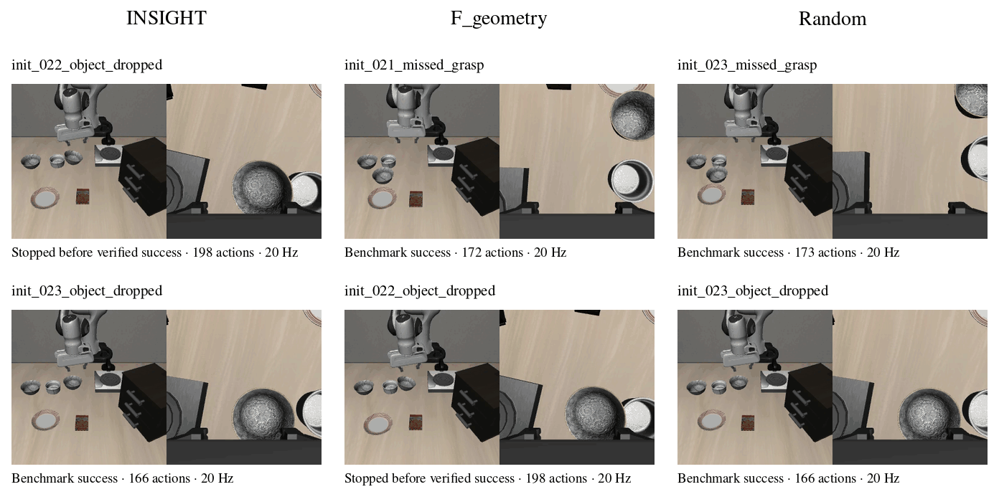

# Recovery State Selection for Vision-Language-Action Models

This project studies how to choose recovery demonstrations after a failed grasp or a dropped object. The main question is whether covering different failure types improves recovery more than selecting states by model uncertainty, given the same demonstration budget.

## Open problem

Uncertainty-based methods can identify states in which a VLA policy is likely
to require assistance. However, uncertainty alone does not indicate which
failure modes should be covered by a limited number of recovery demonstrations.
It therefore remains unclear whether semantic failure-type information can
improve recovery-data selection beyond model uncertainty and random sampling.

## Research question

Given the same budget of recovery demonstrations, does selecting recovery
states by failure type improve VLA recovery success more than selecting them
by model uncertainty?

## Hypothesis

At a fixed recovery-demonstration budget and under the same policy-adaptation
procedure, failure-type-based selection will achieve higher recovery success
on held-out recovery states than uncertainty-based selection. The improvement
is expected to be especially visible in macro-averaged recovery success across
different failure types.

## Experiment

The experiments use a Panda manipulator in LIBERO Spatial. The robot must pick up a specified black bowl and place it on a plate. Controlled interventions create missed grasps and dropped objects; motion and contact checks verify each failure before adding the state to the candidate pool.

Three selection methods request demonstrations from the same pool:

- **INSIGHT-style selection** ranks states using a help classifier trained on token uncertainty features from a frozen pi0-FAST policy.
- **Failure-type selection** chooses states from both failure types, using simulator geometry and gripper contacts.
- **Random selection** samples states without replacement.

## Results so far

A separate ACT pilot tested adaptation with two successful recovery demonstrations per method. Its uncertainty baseline used ensemble disagreement. On 15 reserved recovery starts, the initial policy succeeded in 14 cases, uncertainty selection and failure-type selection in 12 each, and random selection in 13. This pilot did not show a benefit from recovery fine-tuning or an advantage of failure-type selection over uncertainty.

The pi0-FAST experiments cover token-feature extraction, human progress labels, an independent help-detector test, and expert data collection from selected states. Adaptation and independent recovery evaluation of the VLA remain the next step.

## Protocol and tables

[Experimental protocol](METHOD.md) · [Results](RESULTS.md) · [CSV tables](results/)
